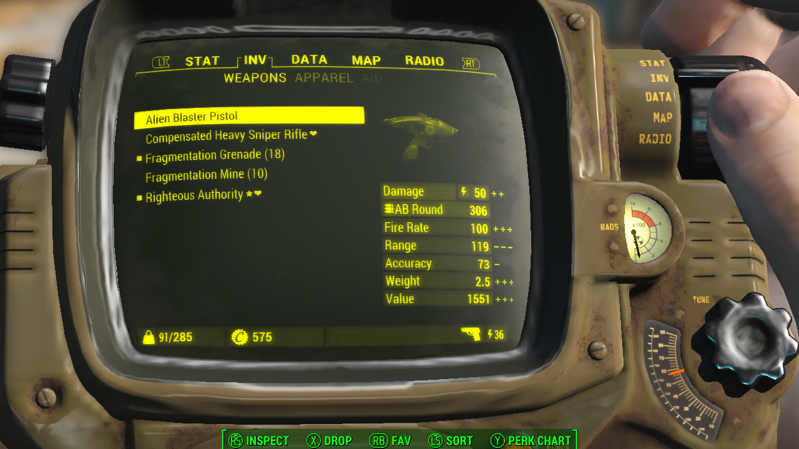
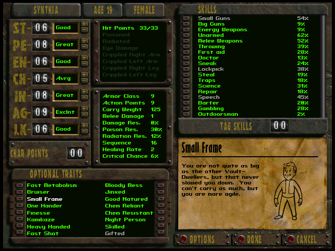
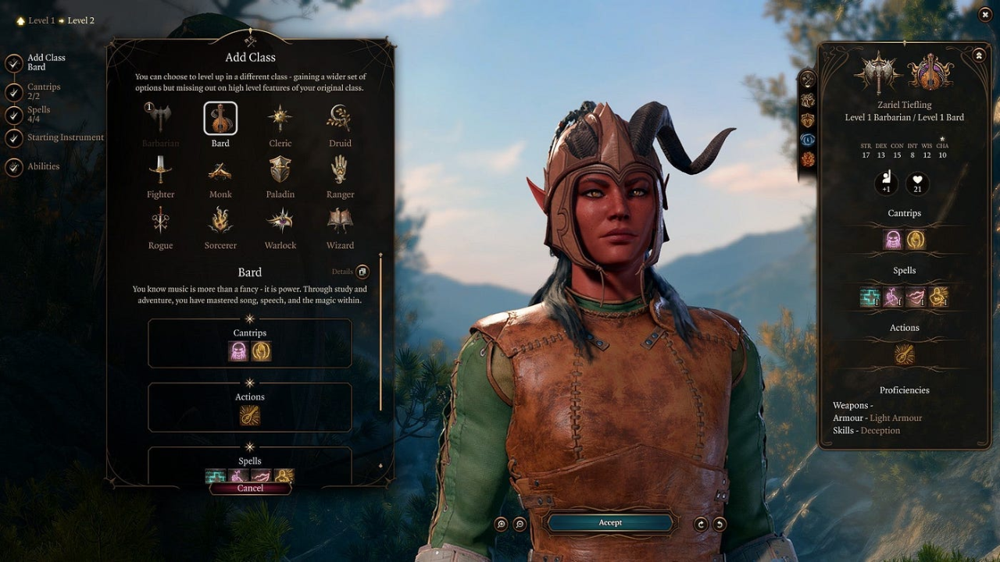
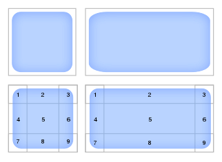
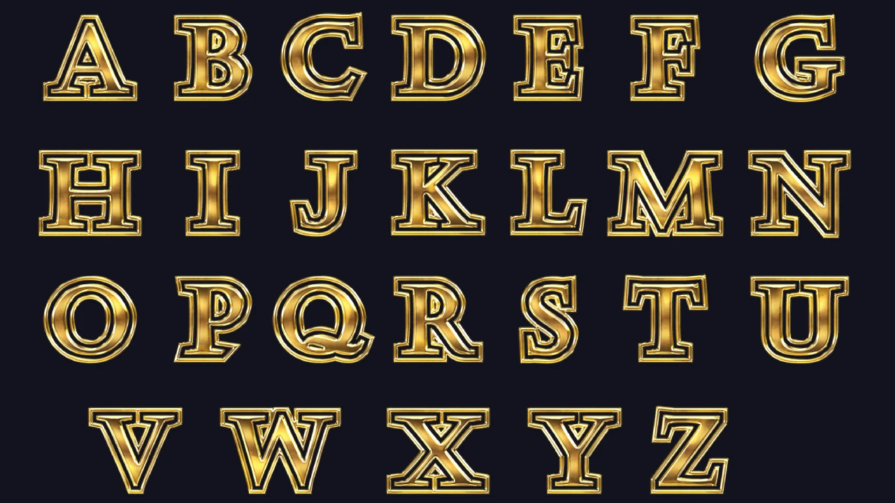
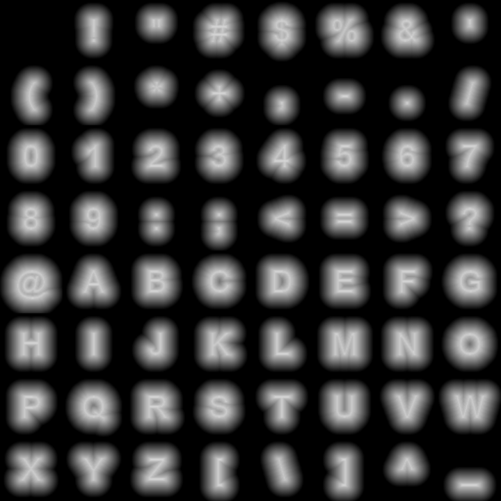
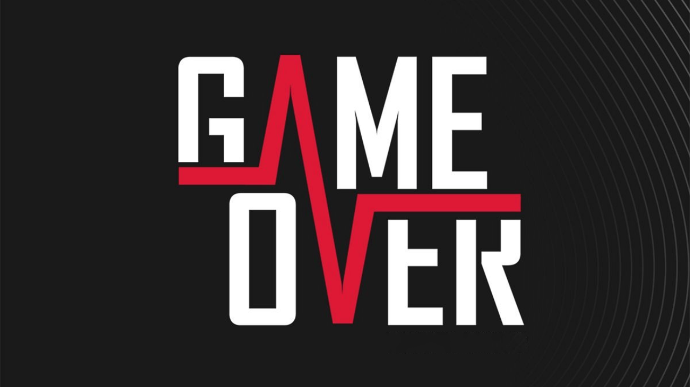
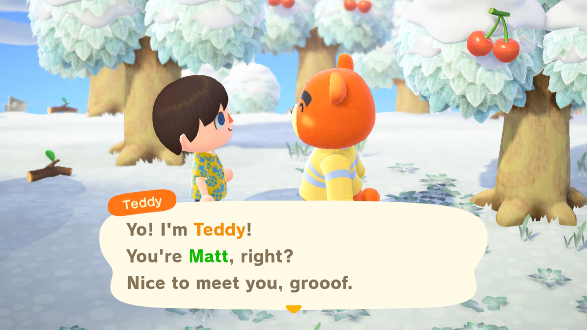
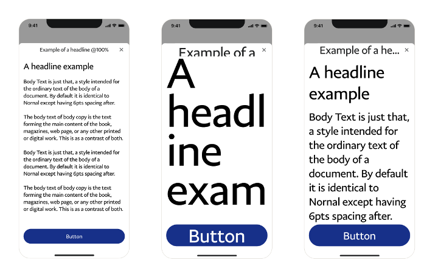

# Game UI Guide

This is a guide for UI/UX artists and designers when they need to send their exported files to the programmers that need to implement them in games.

Most of the things you will find here might seem "common sense", but it has happened before that my common sense and your common sense are not exactly aligned.

**This document is not set in stone!**  
Any comments, suggestions, rants, insults, tweaks, ideas, anything are welcome!

# Foreword
Keep in mind that the more "Flat", "Material", "Minimalistic" or "Neuromorphic" your design is, the easier it will be to program.
An "Skewomorphic" UI design (where elements resemble real-life or in-universe objects) is harder to program and will require careful communication with the programmers.
A "Diegetic" UI design (where the elements live in the same universe as the characters of your game) adds another layer of complexity.

| Diegetic                                                                                                   | Skewomorphic                                                                                                                                                                                        | Neuromorphic                                                                                                                                                        |
|:----:|:----:|:----:|
|                                                                                                           |                                                                                                                                                                                                    |                                                                                                                                                                    |
| Fallout 4   The UI elements exist in universe, your character can see and interact with the UI of your game. | Fallout 1   Your UI elements are representation of objects that can be found in your universe (paper, red plunger buttons, etc) however it is not something your character can see and interact with. | Baldur's Gate 3   It doesn't have to look like an excel spreadsheet, you can still have fancy icons and borders but the elements are not based on in-universe objects |

# Assets

## Glosary
- **Editable**: The raw source files used to make the design.
- **Exported**: The hand-off content that will be integrated in the game.

## Exporting
- If an element is meant to cover a variable aspect ratio, a [9-slices](https://en.wikipedia.org/wiki/9-slice_scaling) can be used, otherwise, the asset will be scaled to fit.
    - A special case of a 9-slice is a 3-slice, commonly used for progress bars and sliders.

||
|:----:|
|Top: Stretching, corners are distorted. Bottom: 9-slice scaling, corners aren't distorted.|

- While exporting, keep in mind that empty space (transparent) around the element will be considered a part of it. This can be used to facilitate item alignment in Fixed and Adaptative designs, but it can backfire on Responsive designs. Use with care.
- Assets meant to work together in the same context should have a cohesive size in pixels.

## Naming Scheme
Exported assets must follow the [CEV (Context, Element, Variant) standard](https://andreferrazdev.medium.com/a-naming-convention-for-ui-components-77f4fb8797c)

- **Context**: What is the context to which this component belongs, uses, or respects? (For game-wide elements, use "Generic")
- **Element**: What kind of UI element the component is?
- **Variant (optional)**: Is this a variation from another component?

**Examples**
- **Dialog**CloseButton*Highlight*
- **Inventory**Scrollbar
- **Settings**Checkbox*Checked*
- **Generic**Frame

# Resolutions and Aspect Ratios

## Glosary
- **Aspect Ratio**: written as `W:H` means how wide something is compared to its height.
- **Orientation**: Portrait or Landscape.
    - **Portrait**: An aspect ratio that is taller than wider. e.g., `9:16`, `9:18.5`, `3:4` (The second number is always larger.)
    - **Landscape**: An aspect ratio that is wider than taller. e.g., `16:9`, `18.5:9`, `4:3` (The first number is always larger.)
    - **Square aspect ratios will be considered as both Portrait and Landscape at the same time** (`1:1`)
- **Resolution or Size**: written as `WxH` means the number of pixels something has.
- **to scale something**: when this guide says that something will be scaled, assume it will be scaled uniformly, respecting the original aspect ratio.
    - **scale to fit**: when something is scaled to fit, it will cover as much as possible without cropping content; in other words, no content will bleed out of the target.
    - **scale to fill**: when something is scaled to fill, it will cover the target, but some cropping or bleeding can occur if the aspect ratio isn't the same.
- **to stretch something**: when this guide says that something will be stretched, it will be scaled without respecting the original aspect ratio.
- **Responsive Design**: This will also encompass "fluid" designs. The content is meant to "flow" and use as much of the screen as possible. Mostly based on "flexboxes" similar to web design. e.g. An inventory grid will have more or less columns depending on the width of the device.
- **Adaptive Design**: The content will change its shape to accomodate for certain aspect ratios. It is mostly used for games that should support both landscape and portrait aspect ratios. e.g. On landscape, buttons are on a sidebar, while on portrait, the same functionality is now in the bottom toolbar.
    - **Aspect ratio Breaks**: The limit on which the content will change shape.
- **Fixed Design**: Content that is designed with a "desired" or "perfect" resolution in mind. This can only be scaled. While this might be the easiest way to design and code UI, it will provide a less user-friendly experience across different devices (for example, buttons too small to be pressed on a mobile device or buttons that are comically large on a computer screen).

## Guidelines

- Ideally, the entire project should have a consistent "desired" resolution. This will avoid some assets looking pixelated for no reason.
    - If the UI is designed in a vector based program (e.g., Illustrator, Figma), this can be fixed during export, but on raster based programs (e.g., Photoshop) this must be considered from the start.
- You can mix Responsive, Adaptative and Fixed design, but you must explain where to use each.
    - For Responsive designs include the "ideal" case along with the limits for the worst case scenarios. e.g., the inventory grid is meant to have more or less columns depending on the width of the screen, *but must never have less than 3 nor more than 6 columns*.
    - For Adaptative designs, include the aspect ratio breaks and mockups of how each break should look like.
    - For Fixed Designs, state the "ideal" or "desired" resolution. (Hopefully, the same for the entire project.)
- Since you can mix Responsive, Adaptative and Fixed design, explain clearly how each element should resize.

# Mockups

## Glosary
- **Full Mockup**: A static visual representation of how the final screen should look.
    - **Partial Mockup**: An isolated example of how a single element should look.
- **Animation Storyboard**: A static visual representation of how the design should animate. Comic book style frames, arrows, and annotations can be used.
- **Placeholder**: Any non-final piece of content.
    - **Placeholder Marker**: A way to clearly mark a piece as a placeholder that is not meant to be reproduced in the final design. e.g., "Lorem Ipsum" will always be considered a placeholder.
- **Redlines**: (also "Redlining") is marking up a UI design mockup by adding red lines indicating spacing and sizing of design elements.

## Guidelines
- Any placeholder item shown in a mockup must obviously be a placeholder. While "Lorem Ipsum" will always be considered a placeholder, for images, consider having the word "placeholder" somewhere in the design.
- Try to include a mockup with redlines.
    - For Responsive designs, common redlines are for margins and paddings.
    - For Adaptative designs, common redlines are in percentages instead of pixels.
    - For Fixed designs, redlines can be either pixels or percentages.
- For Responsive designs, include mockups for the ideal case and the edge or worst cases.
- For Adaptative designs, include mockups for all breaks.
- Animations must be explained or showcased in animation storyboards if they are too complex.
- When sending subtle corrections to a mockup, please include another mockup with markups explaining what changed. Don't assume programmer eyes can spot the difference.

# Safe Areas

## Glosary
- **Notch**: Originally, a cutout on one of the device's edges (usually the uppermost one) but can also include rounded screen corners.
- **Safe Area**: A rectangle that defines the area of the screen that isn't covered by a navigation bar, top status bar, rounded corners, or camera cutouts.

## Guidelines
- Safe area is defined by the game engine, per device.
- When designing elements that should sit flush against the edge of the screen, consider how the element should adjust to the safe area.
    - Buttons and dialogs are usually offset to avoid ending up in a covered, unreachable space.
    - Sidebars, bottom toolbars, toast notifications, and pull-down menus usually bleed the background while the content respects the safe area.
    - Scrims, overlays, and shades usually ignore the safe area since there are neither useful nor interactive elements.
- Any custom behaviour or interaction with the safe area and notches should be explained.

# Text and Fonts

## Glosary
- **Font**: Generaly refers to the "Font Face" or the "name" of the font.
- **Font File**: The vectorial font file, e.g., `ttf`, `otf`, `woff`. While some engines can rasterize vectorial fonts "on the fly" most bake them into a Bitmap Font.
    - **Bitmap Font**: A rasterized image with each glyph that the font needs. The program will use this to "stamp" each character and make text. Creating this kind of asset is usually done automatically by your engine or a tool, but it can be done manually if respecting a particular style is important.
    - **SDF Font**: A special kind of bitmap font allowing for *vector-like* appearance (never pixelates) but limits the styling and effects that can be applied to it. This method won't work for grunge (noisy) fonts.\
- **Font Variant**: Refers to different styles or versions of a font, e.g., weight (light, regular, medium, bold, extra bold, black), width (condensed, narrow, regular, expanded), style (italic, oblique, upright), and caps (small caps, all caps).
- **Text Style**: Everything that affects how the text is displayed. Not only the font face but also the variant, color, and effects.
- **Alternate Characters**: Some fonts have different glyphs to depict the same character. Most game engines are not prepared to show these kinds of fonts.
- **Type Modification**: If for stylistic reasons some glyphs of a text are modified by hand, a manually crafted bitmap font will be required, or that text will need to be exported as an image asset.
- **Rich Text**: When text style needs to change in the middle of a text block or needs to display an image inline.

## Guidelines
- All font files needed must be provided along with their variants.
- The text style must be explained. e.g., font style, color values, gradient stops, stroke width, shadow opacity and angle, etc.
    - If a text style is too complex for the game engine to replicate, a bitmap font will be requested with instructions on how to build it.
- Displaying text in a videogame is not as simple as one might think. Depending on your game engine, you will have limitations on what styles you can apply. If you need to perfectly match some style, you will need to either rasterize the full text as an asset or create a bitmap font.

| Bitmap Font | SDF Font | Needs an asset |
| :--: | :--: | :--: |
|  |  |  |
| This style will probably need a bitmap font since recreating it in engine can be very challenging | This is how an SDF font looks like. It looks like a blurry text but the code will know how to convert it to sharp text | In this case, the text is too stylized to try to recreate with text. This will probably need to be exported as an image asset and localization will have a hard time finding a replacement for the play on shapes between the A and the V |

- Rich text will be limited by the game engine used.

|  |  |
| :---: | :---: |
| Rich text can be used to change the color of the text | But also includes per-glyph effects |

- For responsive layouts, a minimum and maximum text size must be specified.

||
| :---: |
| Finding bad examples sometimes is harder than finding good examples.   Here the text adapts to the space available and flows properly (doesn't get cut outside screen) but that doesn't mean that any font size works. |

# Localization and Internationalization

## Glosary
- Localization: (also called L10N) limits to translation and formatting of numbers and dates.
- Internacionalization: (also called I18N) keeps in mind regional laws and sensibilities (e.g., religious symbols, superstitions, etc.)

## Guidelines
- Remember that some supported languages might have longer or shorter texts.
    - Data on text expansion https://www.kwintessential.co.uk/blog/translation/translation-text-expansion-how-it-affects-design-2
- Fonts will need to support glyphs for supported languages.
- Bitmap fonts will become increasingly complex as more languages are supported.
- Any text that was converted to an image will need its corresponding localized image.

# Colors

## Glosary
- **RGB**: Short for "Red" "Green" and "Blue". References a color by their color values ranging from 0 to 255.
- **Hex Color**: The RGB color expressed in hexadecimal format, usually with a `#` or `0x` at the beginning. The value range is from `00` to `FF` per color.
- **Alpha**: The opacity for a color
    - **RGBA** The alpha is expressed as a fourth value after the red, green, and blue values.
    - **ARGB** The alpha is expressed as the first value, before the red, green, and blue values.

## Guidelines
- Specify colors by their RGB or Hex value.
- Specify alpha separatedly, or specify if you mean RGBA or ARGB.

# Elements

## Scrims, Overlays, Shades, and Patterns
Anything that is meant to uniformly cover the entire screen, regardless of resolution or aspect ratio,
Opacity and color can be handled by code, so in most cases, no asset is needed, only color and alpha values.  
For patterns that repeat to cover the full screen, only the minimum repeatable (tileable) size is needed.

### Special case: Vignettes
Vignettes can be done in code, stretched from a fixed design asset, or done by [9-slicing](https://en.wikipedia.org/wiki/9-slice_scaling) an asset.  

## Frames, Dialogs, and Borders
For Responsive designs, a [9-slice](https://en.wikipedia.org/wiki/9-slice_scaling) asset must be provided with indications on how to slice it.
For Adaptative and Fixed designs frames can use 9-slices (final pixel size must be specified) or export the frame in the exact size.
While exporting keep in mind that empty space (transparent) arround the frame will be considered part of the frame. This can be used to facilitate item alignment.

## Buttons, Checkboxes, Toggles
Avoid "baking" text and icons on buttons if possible. Export the buttons empty, and anything that goes in the button, export it as a separate asset.
(Exceptions can be made for buttons where the button will never have a different icon, like an X on a close button.)

The button must have at least two states: idle and pressed. More states can be included if needed (highlighted, disabled).
Simple tinting, transparency, and scaling can be done by code, but more complex changes will require separate assets.
Text-stlye changes between states must be specified.
In cases where multiple assets are used for button states, the assets must be the same size and align perfectly. (Empty, transparent space is your friend here.)
For Responsive designs [9-slices](https://en.wikipedia.org/wiki/9-slice_scaling) can be used.

While checkboxes are particular cases of buttons with a minimum of two states, one for checked and one for unchecked, toggles can be more difficult.
The simplest and fastest way to make a toggle is to make it a glorified checkbox. With two images one for checked and one for unchecked, but that doesn't allow for animation.

An animated toggle has the following parts, and it's similar to a slider.
- Background
- Knob
- Checked fill (optional)
- Unchecked fill (optional; usually the background acts as the unchecked fill)

## Progress, Sliders
A progress bar needs at least two elements: a background and a fill.
Keep in mind that the progressbar will be sharply masked, so if a rounded end is needed, a "cap" will be needed.
A 9-slice can also be used to keep the rounded ends of a progress bar.
Similar to buttons, the background and fill asset must be the exact same size and line up perfectly. (Empty, transparent space is your friend here.)

A slider has the following parts, and it's similar to a toggle.
- Background
- Knob
- Fill (optional)
- Negative Fill (optional; usually the background is the "empty" fill)

### Special case: Segmented progress
Sometimes segmented progress is just a continuous progress bar with transparent sections in between elements (e.g., a heart counter), but if the segments are not uniform or overlap, different assets will be needed for each segment.